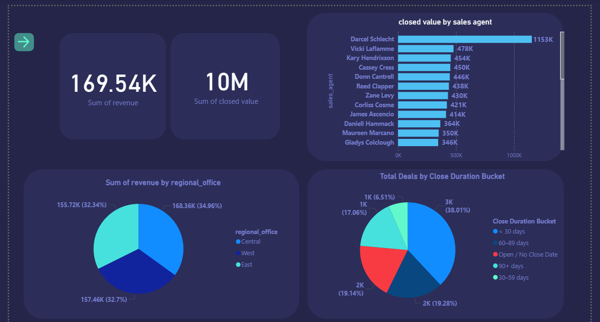
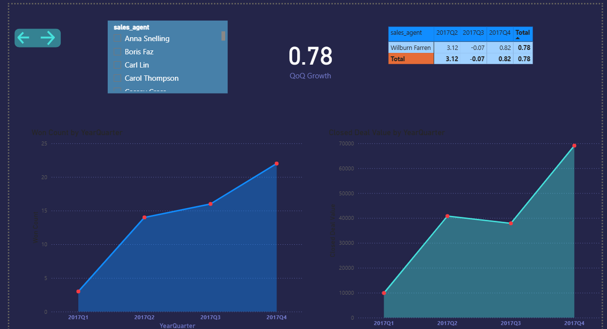
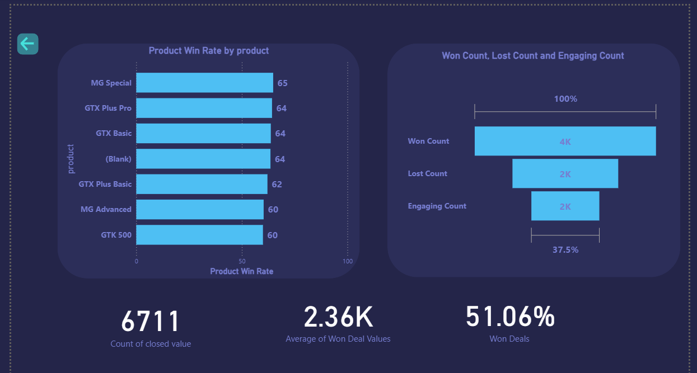

# CRM Data Analysis & Dashboard Project Summary

This project presents a comprehensive analysis and interactive dashboard built with Power BI to unlock valuable insights from a CRM sales dataset. The goal was to transform raw sales pipeline data into actionable intelligence, enabling data-driven decision-making for sales leadership and business stakeholders.

# __📊Project Overview__
The dataset included detailed sales pipeline records, account information, products, and sales team data. Our analysis focused on key performance indicators such as deal outcomes, sales velocity, product performance, and team effectiveness across multiple dimensions.

# __📊Key Steps & Deliverables__

__✅Data Preparation & Modeling:__
Imported and cleaned multiple datasets including accounts, sales pipeline, products, and sales teams. Established robust relationships, notably linking sales data to a custom-built Date Table for advanced time analysis.

__✅Core Metrics Development:__
Created DAX measures for crucial metrics like Total Closed Deal Value, Win Rate, Deal Counts by stage (Won, Lost, Engaging), and Average Deal Size. Ensured dynamic filtering capabilities by sales team, product, and time.

__✅Time-Based Trend Analysis:__
Visualized quarter-over-quarter trends in closed deal values and win counts to reveal seasonal patterns and growth opportunities. Calculated QoQ growth percentages to measure momentum and performance shifts.

__✅Product Analysis:__
Examined win rates and revenue contribution by product, guiding product-focused strategies.

__✅Time-to-Close Buckets:__
Segmented deals into custom buckets based on sales cycle duration, offering insights into pipeline velocity and forecasting accuracy.

__✅Tools & Technologies:__
Power BI: For data integration, modeling, and visualization. Leveraged advanced DAX for dynamic metrics and calculated columns.

__✅DAX (Data Analysis Expressions):__ Custom formulas for performance metrics, rankings, and time intelligence.

__✅Data Modeling:__ Established star schema with fact and dimension tables, including a dedicated Date Table for temporal analysis.

# __📊Impact & Use Cases__
Empowered sales leadership with real-time dashboards to monitor team performance and pipeline health.

Enabled product management to identify top-performing products and adjust strategies.

Improved forecasting accuracy by analyzing sales velocity and time-to-close.

Facilitated data-driven coaching by pinpointing high-impact sales agents and process bottlenecks.
